# AuraTranslator v2 — Hybrid AI Translation Architecture

## Overview

AuraTranslator v2 is a **hybrid translation platform** that minimizes dependency on paid APIs by prioritizing open-source models, with intelligent fallback and continuous learning from user feedback.

## Architecture Diagram

```mermaid
flowchart TB
    subgraph Client["Browser Client"]
        UI[Next.js UI]
        IDB[(IndexedDB Cache)]
        STT[Web Speech API]
        TTS[Speech Synthesis]
        OCR[Tesseract.js OCR]
    end

    subgraph CloudRun["Google Cloud Run"]
        API[Next.js API Routes]
        Router[Hybrid Model Router]
        TM[(Translation Memory)]
        FB[(Feedback Store)]
    end

    subgraph MLService["ML Service — Cloud Run GPU"]
        NLLB[NLLB-200]
        M2M[M2M100]
        Marian[MarianMT]
        Indic[IndicTrans2]
        OPUS[OPUS-MT]
        Domain[Domain Fine-tuned]
    end

    subgraph Fallback["API Fallback Layer"]
        Google[Google Translate]
        Libre[LibreTranslate]
        Free[Free Translate API]
    end

    subgraph Learning["Continuous Learning"]
        Pipeline[ML Pipeline]
        GCS[(Cloud Storage)]
        Vertex[Vertex AI Training]
        Firestore[(Firestore Corrections)]
    end

    UI --> API
    API --> Router
    Router --> TM
    Router --> MLService
    Router --> Fallback
    UI --> IDB
    FB --> Firestore
    Firestore --> Pipeline
    Pipeline --> Vertex
    Pipeline --> GCS
    GCS --> Domain
```



## Hybrid Routing Logic

| Condition | Primary Model | Fallback Chain |
|-----------|--------------|----------------|
| Indian language pair (hi, bn, ta, te, etc.) | IndicTrans2 | NLLB-200 → Google API → Free API |
| Domain-specific (legal, medical, etc.) | Domain Fine-tuned | IndicTrans2/NLLB → Google API |
| Lightweight request | MarianMT | OPUS-MT → NLLB-200 |
| Well-supported OPUS pair (en-de, en-fr) | OPUS-MT | MarianMT → NLLB-200 |
| General multilingual | NLLB-200 | M2M100 → MarianMT → APIs |
| Low confidence (<60%) | Next in chain | Until acceptable or mock |

## Model Selection

### Open-Source Models (No per-request cost)

| Model | Use Case | Languages |
|-------|----------|-----------|
| **NLLB-200** | General multilingual | 200+ |
| **M2M100** | Many-to-many translation | 100+ |
| **MarianMT** | Lightweight, fast pairs | Pair-specific |
| **IndicTrans2** | Indian languages | 12 Indian + English |
| **OPUS-MT** | European/major pairs | Pair-specific |

### Indian Language Support

Bengali, Hindi, Marathi, Tamil, Telugu, Kannada, Malayalam, Gujarati, Punjabi, Assamese, Odia, Urdu — optimized via IndicTrans2 with domain prompts for government, education, news, and technical content.

## Continuous Learning Pipeline

```
User Feedback → Firestore (translation_corrections)
    → Export corrections (retrain.py)
    → Clean & tokenize
    → Fine-tune NLLB on domain data
    → Evaluate (BLEU, chrF)
    → Deploy to /models/domain/{domain}/
    → ML Service loads domain model
```

## Evaluation Metrics

- **BLEU** — n-gram overlap (sacrebleu)
- **chrF** — character-level F-score
- **COMET** — neural metric (optional, via evaluate script)
- **Latency** — per-request ms
- **Confidence** — model-estimated + heuristic scoring

## Deployment Topology

| Service | Platform | Resources |
|---------|----------|-----------|
| Next.js App | Cloud Run | 512Mi–1Gi, CPU |
| ML Service | Cloud Run | 8Gi, 4 CPU (GPU optional) |
| Models | Cloud Storage / Volume | Cached on startup |
| Corrections | Firestore | Auto-export for retraining |
| Secrets | Secret Manager | API keys |

## Live Deployment

**Production URL:** https://auratranslator-694414640481.us-central1.run.app

**ML Service URL:** Configure `ML_SERVICE_URL` to point to `auratranslator-ml` Cloud Run service after deploying with `deploy-ml.yml`.

## Directory Structure

```
src/lib/translation/     # Hybrid router & providers
ml-service/              # FastAPI open-source inference
ml-pipeline/             # Data collection, training, eval
docker-compose.yml       # Local full stack
.github/workflows/       # CI/CD for app + ML + pipeline
```
